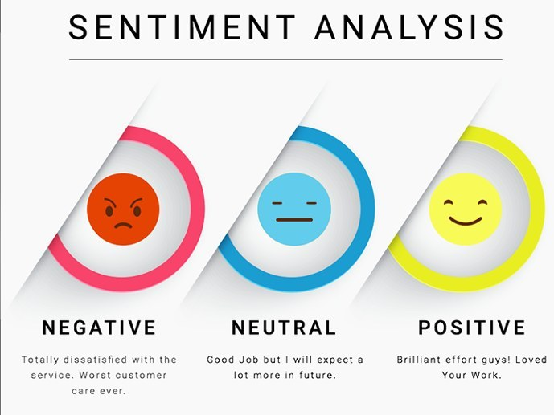

Covid_ 19 Tweet Sentiment Analysis

The primary objective of this project is to create a machine learning model that can evaluate the sentiment (positive, neutral, or negative) of Twitter posts specifically related to vaccinations. The model will analyze the content of these tweets and classify them based on their sentiment, providing valuable insights into public opinions and attitudes towards vaccinations on social media platforms.

Dataset

The dataset comprises of tweets that have been collected and categorized using Dataset. The tweets are labeled as positive (👍), neutral (🤐), or negative (👎). In order to protect privacy, usernames and web addresses have been excluded from the dataset.

Objective
The primary objective is to develop a machine learning model capable of accurately predicting the sentiment of tweets related to vaccinations. The goal is to create a model that can effectively determine whether the sentiment of a given tweet is positive, neutral, or negative, providing valuable insights into public opinions and attitudes towards vaccinations.

How to Participate
You can obtain access to the dataset from Crowdbreaks.org by following the dataset link provided. The dataset includes labeled tweets that can be used as training data for developing your machine learning model. It is recommended to use this labeled data to train your model effectively.

After training your model, you should evaluate its performance using appropriate evaluation metrics. Once your model is trained and evaluated, you can use it to make predictions on new or unseen data, such as the tweets provided in the Test.csv file.

To participate in the challenge, you are encouraged to share your approach, code, and results on the Zindi platform. This will allow you to actively engage in the challenge and compare your model's performance with other participants.

The available files for download include:

Train.csv: Contains labeled tweets that can be used for training your model.
Test.csv: Contains tweets that you need to classify using your trained model.
SampleSubmission.csv: Serves as an example of the submission file format. Ensure that the ID names are correct, and the 'label' column values range between -1 and 1.
NLP_Primer_twitter_challenge.ipynb: This starter notebook can assist you in making your initial submission for the challenge.
The train dataset consists of the following features:

tweet_id: A unique identifier for each tweet.
safe_tweet: The text content of the tweet with sensitive information (usernames, URLs) removed.
label: The sentiment of the tweet, with -1 representing negative sentiment, 0 for neutral, and 1 for positive sentiment.
agreement: The percentage of agreement among the three reviewers for the given label.

Modelling

